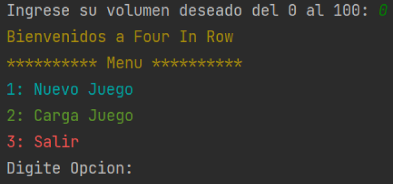
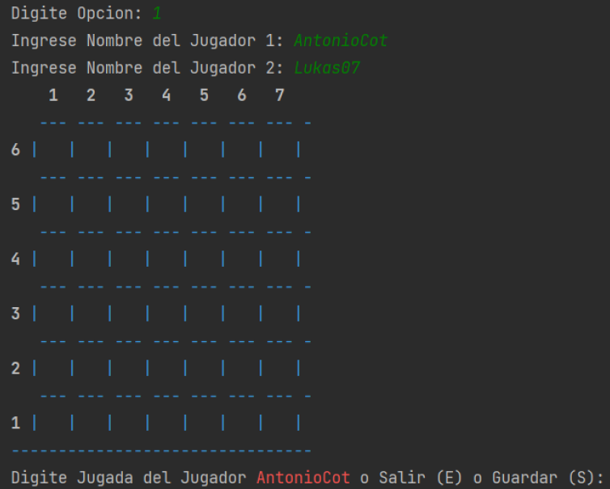
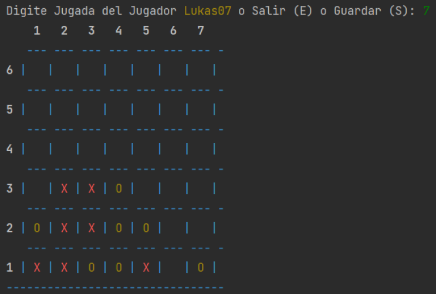
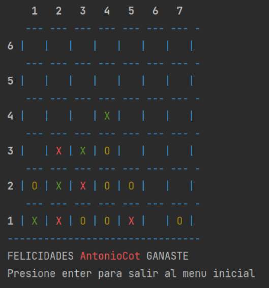
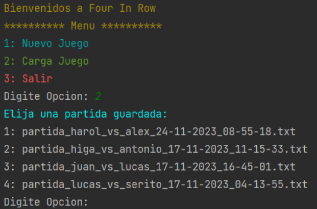

# 🎮 **4 en Raya - Juego de Consola**

¡Bienvenido al clásico **4 en Raya**! Un juego interactivo para jugar en consola donde el objetivo es lograr **cuatro fichas consecutivas** en horizontal, vertical o diagonal en un tablero de 6x7. Este README te explicará cómo jugar, cómo descargar el juego y cómo disfrutar de esta experiencia.

---

## 🚀 **Características del Juego**

1. **Modo 2 Jugadores:** Cada jugador introduce su jugada por turnos.
2. **Objetivo del Juego:** 
   - Haz **4 en Raya** antes que tu oponente.
   - Las fichas ganadoras se resaltan en color verde para indicar al ganador.
3. **Guardar y Cargar Partidas:** Puedes **guardar** tu partida en cualquier momento y retomarla más tarde.
4. **Interfaz de Consola:** Juego sencillo y divertido con opciones en el menú.

---

## 🖼 **Imágenes del Juego**

1. **Menú Principal**
   - Imagen sugerida: `assets/menu_principal.png`
   - 
   - 🎯 Describe las opciones:
     - **Nuevo Juego:** Comienza una nueva partida.
     - **Cargar Juego:** Retoma partidas guardadas.
     - **Salir:** Salir del juego.

2. **Tablero Inicial**
   - Imagen sugerida: `assets/tablero_inicial.png`
   - 
   - Explica que el tablero es de 6 filas x 7 columnas y está vacío al inicio.

3. **Jugadas de los Jugadores**
   - Imagen sugerida: `assets/turnos_jugadores.png`
   - 
   - Explica cómo cada jugador ingresa una columna y la ficha se coloca automáticamente en la posición más baja.

4. **Juego Ganado**
   - Imagen sugerida: `assets/juego_ganado.png`
   - 
   - Muestra cómo se resaltan las **4 fichas consecutivas** en verde cuando un jugador gana.

5. **Cargar Partida Guardada**
   - Imagen sugerida: `assets/cargar_partida.png`
   - 
   - Explica el sistema de archivos y cómo se recuperan partidas guardadas.


---

## 🛠️ **Requisitos**

- **Python 3.8 o superior** instalado en tu computadora.
- Biblioteca estándar de Python (no se necesitan dependencias externas).

---

## 🔧 **Cómo Descargar y Jugar**

1. **Clona el Repositorio:**
   Abre una terminal y ejecuta el siguiente comando:
   ```bash
   git clone https://github.com/AntonioCot7/Proyecto-Four-In-Row.git
   ```

2. **Accede a la Carpeta del Juego:**
   ```bash
   cd Proyecto-Four-In-Row
   ```

3. **Ejecuta el Juego:**
   ```bash
   python Proyecto.py
   ```

---

## 🎮 **Cómo Jugar**

1. **Inicio del Juego:**
   - Ingresa tu **nombre** y el de tu oponente.
   - Elige el volumen deseado del juego.

2. **Turnos:**
   - Cada jugador introduce un número entre `1` y `7` para elegir una columna.
   - La ficha (`X` o `O`) caerá automáticamente en la posición más baja de la columna seleccionada.

3. **Objetivo:**
   - Lograr **4 en Raya** en horizontal, vertical o diagonal.
   - Cuando un jugador gana, las fichas se **pintan de verde** y se muestra el mensaje **"Felicidades, GANASTE"**.

4. **Guardar Partida:**
   - En cualquier momento, puedes presionar `S` para **guardar** tu partida y retomarla más tarde.

5. **Cargar Partida:**
   - Desde el menú principal, selecciona **"Cargar Juego"** para reanudar una partida guardada.

6. **Salir:**
   - Presiona `E` para salir del juego en cualquier momento.

---

## 📚 **Estructura del Proyecto**

```plaintext
Proyecto-Four-In-Row/
│
├── Guardados.py         # Archivo donde se gestionan las partidas guardadas
├── Proyecto.py          # Archivo principal para ejecutar el juego
├── music_gameplay.mp3   # Música de fondo durante el juego
├── music_win.mp3        # Música al ganar
├── README.md            # Este archivo con toda la información
├── Partidas/            # Carpeta con partidas guardadas
└── assets/              # Carpeta sugerida para las imágenes del README
```

---

## 🎵 **Música del Juego**

El juego cuenta con dos efectos de sonido:
- **Gameplay:** `music_gameplay.mp3` - Música de fondo.
- **Victoria:** `music_win.mp3` - Se reproduce cuando un jugador gana.

---

## 📄 **Licencia**

Este proyecto está bajo la licencia MIT. Puedes usarlo, modificarlo y compartirlo libremente.

---

¡Disfruta jugando **4 en Raya** en la terminal! 🎉
